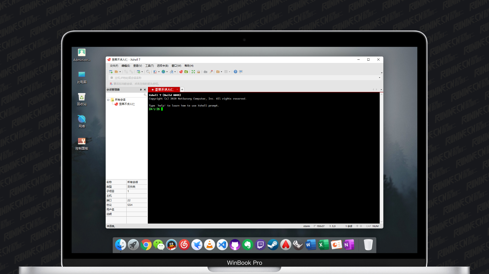

##### Xshell

**Xshell** 是NetSarang推出的一款非常好用的远程控制软件，旨在为广大用户解决远程控制方面的各种问题，支持Telnet、Rlogin、SSH/SSH PKCS＃11、SFTP、Serial等远程协议，可以很好的满足用户的使用需求。相比较传统的远程工具，该软件界面简洁，功能强大，可以轻松的管理远程服务器、会话管理器，通过提供业界先进的性能，Xshell包含了其他SSH客户端所没有的功能和优势，不仅拥有高效且安全的连接功能，还为用户提供了各种方便的管理工具，包含有自定义键盘映射、上传或下载文件、动态端口转发、VB脚本支持等功能，帮助用户很好的管理远程服务器。

------

##### Xftp

**Xftp** 是NetSarang推出的一款功能强大且实用的SFFT/FTP文件传输软件，采用了标准的 Windows 风格的向导，能与其他Windows应用程序紧密地协同工作，使用简单、快捷深受广大用户的喜爱。主要用于需要安全地通过网络传输文件的用户，可以帮助你的电脑和远程计算机进行文件同步，完美支持SFTP、FTP传输。使用软件能让文件传输被简化，支持Windows和UNIX/Linux等多平台之间传输内容，同时Xftp 7具有很好的安全性，你完全可以放心自己的数据在传输中不被泄漏。该软件提供了简单的站点建立方式，你可以在服务器上创建属于自己的IP，并设置自己的上传站点，这样下一次在使用传输服务的时候就可以一键连接到服务器上，为用户节约设计传输服务的时间，既可以同时适应初级用户和高级用户的需要，添加到链接栏的会话现在支持快捷方式，也可以搜索/筛选当前目录的文件和子目录，或在会话文件夹级别设置会话属性，帮助用户轻松的通过节约文件下载和上传的时间编辑提高生产力。